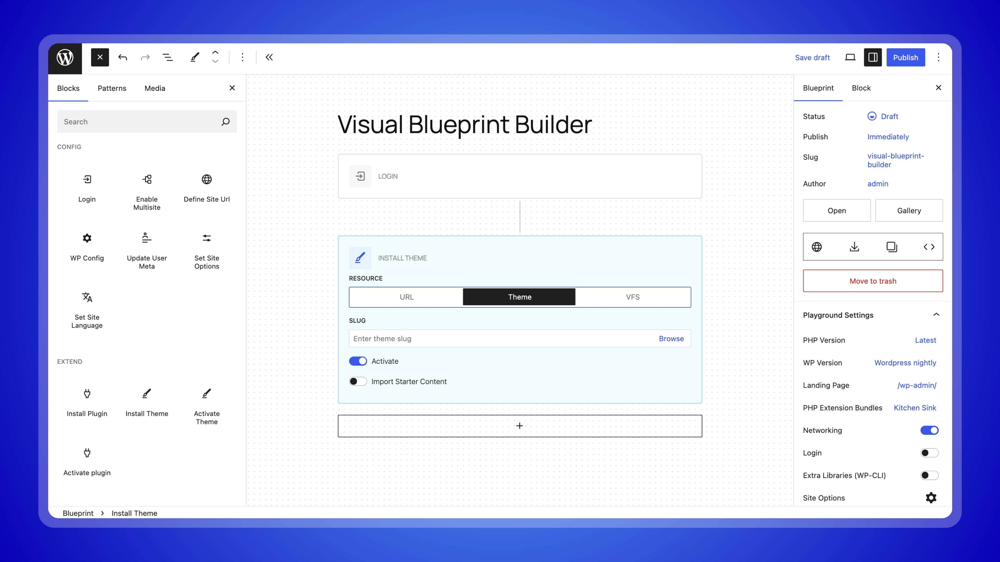

<!-- @format -->

<p align="center"></p>



[![Playground Demo Link](https://img.shields.io/badge/Live%20Preview-3858e9?style=for-the-badge&logo=data%3Aimage%2Fsvg%2Bxml%3Bbase64%2CCjxzdmcgeG1sbnM9Imh0dHA6Ly93d3cudzMub3JnLzIwMDAvc3ZnIiB3aWR0aD0iMTAwIiBoZWlnaHQ9IjEwMCIgZmlsbD0ibm9uZSI%2BPHBhdGggZmlsbD0iI2ZmZiIgZmlsbC1ydWxlPSJldmVub2RkIiBkPSJNMTEuOSAzNi40MjVjLTIuMTgxIDMuMDA3LTMuMzMyIDYuNzAzLTMuNTE3IDEwLjc2NWEyNi40MyAyNi40MyAwIDAgMC0uMDE0IDEuOTk4Yy4yNzYgOS4xMzggNS4xMzQgMTkuNzggMTMuODk4IDI4LjU0NEMzNS42NzggOTEuMTQ0IDUzLjQ5MiA5NS40MSA2My41NzUgODguMWMtNC4yNDEtMS04LjUzMi0yLjU1OC0xMi43NTctNC42MzVhMjMuMDE5IDIzLjAxOSAwIDAgMS0zLjUwMi0uNDRjLTIuMTM5LS40MjctNC40LTEuMTYxLTYuNzAzLTIuMjA2LTQuMjEzLTEuOTEtOC41NjgtNC44NTctMTIuNTcyLTguODYxLTQuMDA0LTQuMDA0LTYuOTUtOC4zNTgtOC44Ni0xMi41Ny0xLjA0NS0yLjMwNC0xLjc4LTQuNTY2LTIuMjA3LTYuNzA0YTIzLjAwNiAyMy4wMDYgMCAwIDEtLjQzOS0zLjUwMWMtMi4wNzgtNC4yMjYtMy42MzYtOC41MTctNC42MzYtMTIuNzU4Wm0tOC40MDEgMjUuNDNjLjMwNS0uMzA1LjYyNS0uNTkuOTYtLjg1NGE1MC4zNzIgNTAuMzcyIDAgMCAwIDMuODY4IDguNTI2Yy0uMjE0Ljk0My0uMjYgMi4yMzUuMDg3IDMuOTY2LjY4OCAzLjQzNyAyLjgzMSA3LjY1NyA2LjYzNCAxMS40NiAzLjgwMiAzLjgwMiA4LjAyMiA1Ljk0NSAxMS40NTkgNi42MzMgMS43MzIuMzQ2IDMuMDI0LjMwMSAzLjk2Ny4wODdBNTAuMzc1IDUwLjM3NSAwIDAgMCAzOSA5NS41NDFjLS4yNjQuMzM0LS41NS42NTUtLjg1NS45Ni02LjM3OCA2LjM3OC0xOS4zMDQgMy43OTMtMjguODcyLTUuNzc0Qy0uMjk0IDgxLjE1OS0yLjg3OSA2OC4yMzMgMy41IDYxLjg1NVptMzEuNzYgMi44ODZDNTQuMzkyIDgzLjg3NSA4MC4yNDUgODkuMDQ2IDkzLjAwMSA3Ni4yOWM0LjYxMy00LjYxMyA2Ljg4MS0xMC45MzcgNi45OTQtMTguMDM3LjE5OC0xMi41MzYtNi4zMjctMjcuNDktMTguNTQzLTM5LjcwNkM2Mi4zMi0uNTg4IDM2LjQ2Ni01Ljc2IDIzLjcxIDYuOTk3Yy00LjYxOCA0LjYyLTYuODg3IDEwLjk1NC02Ljk5NCAxOC4wNjYtLjE4NyAxMi41MyA2LjMzNiAyNy40NzEgMTguNTQzIDM5LjY3OFptMjYuOTQ2IDMuMzk1Yy4zNTYgMS43NzcuNDkyIDMuMzg0LjQ1IDQuODI3LTcuMTg1LTIuNTAxLTE0LjgtNy4xNzQtMjEuNjIyLTEzLjk5Ni02LjgyMi02LjgyMi0xMS40OTUtMTQuNDM3LTEzLjk5Ni0yMS42MjMgMS40NDItLjA0IDMuMDUuMDk1IDQuODI2LjQ1IDYuMDUgMS4yMSAxMy4wODEgNC44NzMgMTkuMjc2IDExLjA2NyA2LjE5NCA2LjE5NSA5Ljg1NyAxMy4yMjYgMTEuMDY2IDE5LjI3NVpNMjkuNDg0IDEyLjc3MmMtMy40NTggMy40NTgtNS4zMDIgOS4wOC00LjM3MyAxNi41MjEgOS43ODEtLjk1IDIxLjk3MyAzLjk2NSAzMS44MDIgMTMuNzk0IDkuODI4IDkuODI4IDE0Ljc0NSAyMi4wMiAxMy43OTQgMzEuODAxIDcuNDQuOTMgMTMuMDYzLS45MTUgMTYuNTItNC4zNzIgMy44NDgtMy44NDcgNS42OTgtMTAuMzc2IDMuOTUyLTE5LjEwNC0xLjczMi04LjY2Mi02LjkxNC0xOC41MDUtMTUuNS0yNy4wOTEtOC41ODYtOC41ODYtMTguNDMtMTMuNzY4LTI3LjA5MS0xNS41LTguNzI5LTEuNzQ2LTE1LjI1Ny4xMDQtMTkuMTA0IDMuOTUxWiIgY2xpcC1ydWxlPSJldmVub2RkIi8%2BPC9zdmc%2B&logoSize=auto)](https://playground.wordpress.net/?blueprint-url=https://raw.githubusercontent.com/lubusIN/visual-blueprint-builder/playground/_playground/blueprint-github.json)

### Overview

Visual Blueprint Builder is block based editing experience for building blueprint.json

### Features

- UI based json generation
- blocks to build steps
- Preview blueprint in playground
- download blueprint.json
- copy json code

## Requirements

- WordPress 6.4+
- PHP 7.4+

## Installation

1. Download latest release from GitHub
2. Visit `Plugins > Add New`
3. Upload `visual-blueprint-builder.zip` file
4. Activate `Visual Blueprint Builder` from plugins page

## Development

### 1. Clone the Repository

Clone the repository to your local system:

```bash
git clone git@github.com:lubusIN/visual-blueprint-builder.git
```

### 2. Go to package folder

```bash
cd visual-blueprint-builder
```

### 3. Install Dependencies

```bash
npm install
composer install
```

### 4. Build Plugin

Build or start the development environment:

```bash
npm run build       # Compile the source files
# OR
npm run start       # Watch for changes and auto-compile
```

### 5. Launch Playground

Start a local WordPress playground using wp-now:

```bash
npx @wp-now/wp-now start
```

> [!NOTE]
> Refer to `package.json` for additional available npm commands.

## Meet Your Artisans

[LUBUS](http://lubus.in) is a web design agency based in Mumbai, India.

<a href="https://cal.com/lubus">

</a>

## Credits

<a href="https://github.com/lubusIN/visual-blueprint-builder/graphs/contributors">
  
</a>

## License

Visual Blueprint Builder is open-sourced plugin licensed under the [GPL-3.0 license](LICENSE)
